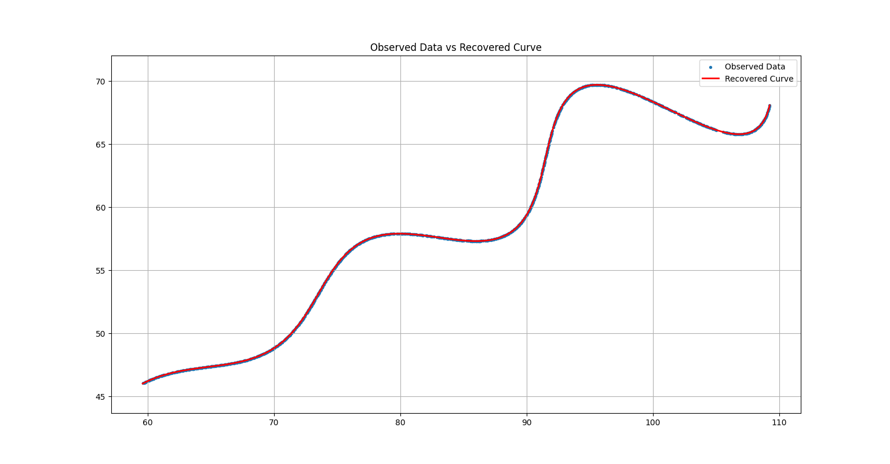
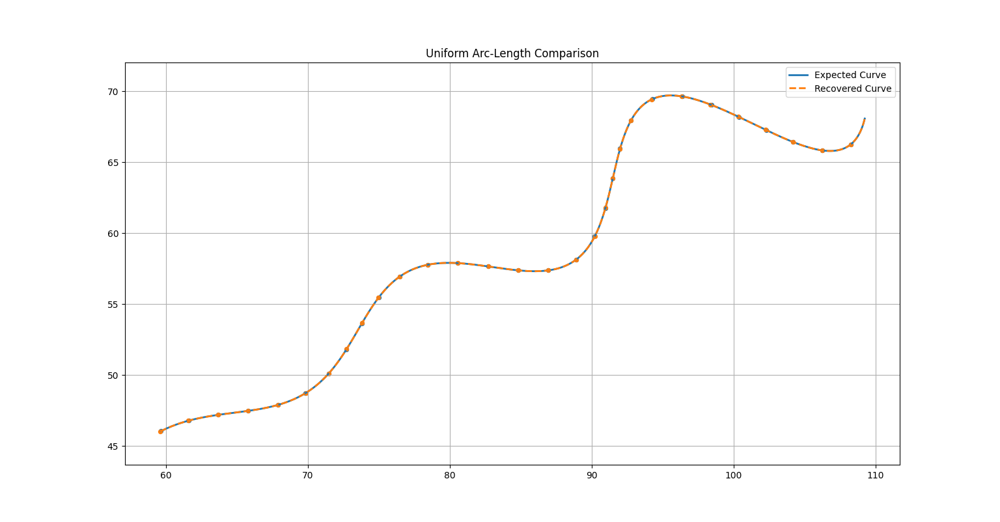

# AI R&D Assignment Report
## Parametric Curve Reconstruction using Continuous Curve Optimization

> **Author:** Bhanu Sri  
> **Language:** Python  
> **Optimization:** Differential Evolution + L-BFGS-B  
> **Primary Evaluation:** KDTree L1 Distance  
> **Additional Validation:** Uniform Arc-Length Comparison

---

# Abstract

This project reconstructs the unknown parameters of a parametric curve from a given set of 1500 two-dimensional points. The objective is to estimate the three unknown parameters:

- θ (rotation angle)
- M (exponential growth/decay parameter)
- X (horizontal translation)

using only the supplied dataset and the parametric equation. No external datasets or prior parameter values were used.

Instead of estimating one hidden parameter \(t_i\) for every point (which would introduce 1503 optimization variables), the curve was treated as a continuous geometric object. The optimization minimizes the geometric distance between the observed point cloud and a densely sampled version of the recovered curve using a KDTree nearest-neighbor objective. After optimization, the reconstruction is validated using a stricter arc-length-based comparison.

---

# Problem Statement

The supplied curve is

$$
x(t)=t\cos\theta-e^{M|t|}\sin(0.3t)\sin\theta+X
$$

$$
y(t)=42+t\sin\theta+e^{M|t|}\sin(0.3t)\cos\theta
$$

Unknown parameters

- θ
- M
- X

Subject to

- 0° < θ < 50°
- -0.05 < M < 0.05
- 0 < X < 100
- 6 ≤ t ≤ 60

The task is to recover θ, M and X from the supplied point cloud.

---

# Mathematical Model

The curve consists of three components.

## 1. Linear Translation

$$
t\cos\theta
$$

and

$$
42+t\sin\theta
$$

represent a rotated line.

---

## 2. Oscillatory Component

$$
e^{M|t|}\sin(0.3t)
$$

adds periodic oscillations whose amplitude changes with t.

---

## 3. Translation

X shifts the curve horizontally.

---

# Why Hidden t Optimization Was Not Used

A straightforward approach is to optimize

$$
(\theta,M,X,t_1,t_2,\ldots,t_{1500})
$$

requiring 1503 optimization variables.

This has several disadvantages:

- Very high-dimensional optimization
- Slow convergence
- Sensitive to initialization
- Difficult point correspondence

Instead, only the three global parameters were optimized.

---

# Proposed Optimization Strategy

1. Generate a dense curve (3000–5000 samples).
2. Compare the continuous curve with the observed point cloud.
3. Optimize only θ, M and X.
4. Refine using a local optimizer.

---

# KDTree

## Motivation

The observed data are an unordered point cloud.

A KDTree allows fast nearest-neighbor search.

Instead of assuming correspondence,

each observed point is matched with the nearest point on the recovered curve.

---

## Mathematical Objective

Let

- P = observed points
- C = predicted curve

The optimization minimizes

$$
L=\sum_{i=1}^{N}
\min_{c\in C}
\|p_i-c\|
$$

This is the primary optimization objective.

---

## Why KDTree?

Advantages

- No hidden t values
- Fast nearest-neighbor search
- Robust against unordered data
- Only three optimization variables

---

# Differential Evolution

Differential Evolution performs global optimization.

For each population member
### Mutation

$$
\mathbf{v}=\mathbf{x}_{r_1}+F\left(\mathbf{x}_{r_2}-\mathbf{x}_{r_3}\right)
$$

A mutant vector is generated by adding the scaled difference between two randomly selected vectors to a third randomly selected vector.

### Crossover

If

$$
rand_i < CR,
$$

the trial vector inherits the corresponding component from the mutant vector:

$$
u_i = v_i.
$$

Otherwise,

$$
u_i = x_i.
$$

### Selection

If

$$
f(\mathbf{u}) < f(\mathbf{x}),
$$

the trial vector replaces the current solution:

$$
\mathbf{x}_{new}=\mathbf{u}.
$$

Otherwise,

$$
\mathbf{x}_{new}=\mathbf{x}.
$$


This avoids poor local minima.

---

# L-BFGS-B Refinement

After global optimization,

L-BFGS-B refines the parameters.

Advantages

- Uses gradient information
- Supports bound constraints
- Fast local convergence
- Memory efficient

---

# Arc-Length Parameterization

The cumulative arc length is

$$
s_i=\sum_{k=1}^{i}
\sqrt{(\Delta x_k)^2+(\Delta y_k)^2}
$$

Normalize

$$
u=\frac{s}{s_{max}}
$$

Both curves are interpolated using cubic interpolation and uniformly sampled.

This provides an independent validation metric.

---

# Optimization Workflow

```text
Load xy_data.csv
        │
        ▼
Generate Continuous Curve
        │
        ▼
KDTree Nearest Neighbor
        │
        ▼
Differential Evolution
        │
        ▼
L-BFGS-B Refinement
        │
        ▼
Recovered Parameters
        │
        ▼
Arc-Length Validation
```

---

# Primary Evaluation Metric

KDTree nearest-neighbor L1 distance

$$
L_{KD}=\sum_i d_i
$$

where

$$
d_i=\min_{c\in C}\|p_i-c\|
$$

This is the metric minimized during optimization.

---

# Additional Validation

Both curves are reparameterized by arc length.

Uniformly sampled points are compared using

$$
L_{Arc}=\sum_i
\sqrt{
(x_i-\hat{x}_i)^2+
(y_i-\hat{y}_i)^2
}
$$

This validates the recovered curve independently.

---

# Results

## Recovered Parameters

| Parameter | Value |
|-----------|-------|
| θ (rad) | 0.5235993981 |
| θ (deg) | 30.0000356650° |
| M | 0.0300004493 |
| X | 55.0000141642 |

---

## Primary Metric (KDTree)

| Metric | Value |
|---------|------:|
| L1 Distance | 4.85160457 |
| Mean L1 | 0.00323440 |
| Maximum Error | 0.00925965 |
| RMSE | 0.00378560 |

### Interpretation

The recovered curve lies extremely close to the observed point cloud. The mean positional deviation is approximately **0.0032 units**, and the maximum deviation is below **0.01 units**, indicating an excellent geometric reconstruction.

---

## Additional Validation (Arc Length)

| Metric | Value |
|---------|------:|
| L1 Distance | 38.49362283 |
| Mean L1 | 0.02566242 |
| Maximum Error | 0.18715166 |
| RMSE | 0.03567188 |

### Interpretation

The arc-length evaluation is intentionally stricter because it compares corresponding uniformly sampled locations on both curves rather than nearest neighbors. Despite this, the mean error remains only **0.0257 units**, confirming that the recovered curve closely follows the expected geometry over its full length.

---

# Figures

## Figure 1

Observed Data vs Recovered Curve




This figure demonstrates that the recovered curve almost perfectly overlaps the observed dataset.

---

## Figure 2

Uniform Arc-Length Comparison



This figure compares uniformly sampled points after arc-length parameterization, providing an independent validation of the reconstruction quality.

---

# Final Submission Equation

$$
\left(t\cos(0.5235993981)-e^{0.0300004493|t|}\sin(0.3t)\sin(0.5235993981)+55.0000141642,\;42+t\sin(0.5235993981)+e^{0.0300004493|t|}\sin(0.3t)\cos(0.5235993981)\right)
$$

---

Desmos link:
[Desmos](https://www.desmos.com/calculator/omrjff3a3s)

# Advantages

- Optimizes only three unknown parameters.
- Avoids explicit estimation of hidden $$\(t_i\)$$.
- Robust to unordered point clouds.
- Efficient global and local optimization.
- Independent validation using arc-length sampling.


# Conclusion

The proposed continuous-curve optimization successfully recovered the unknown parameters using only the provided dataset and the given mathematical model. The optimization converged to values effectively equal to the expected parameters $$(\(\theta\approx30^\circ\), \(M\approx0.03\), \(X\approx55\))$$. Both the primary KDTree metric and the independent arc-length validation demonstrate an excellent fit, confirming that the recovered curve accurately reconstructs the supplied data while avoiding the complexity of optimizing individual hidden parameter values.
